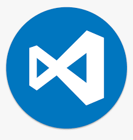
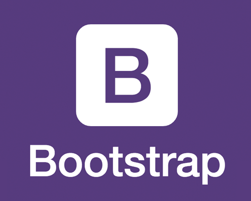

### Heyy Lady and Gentlemen, I'm Serdar 👋

## 📌 GitHub Stats And Top Languages

  
  

## 📚 Learning & Interested

## 📚 My Medium Account
[@serdar83durmus](https://medium.com/@serdar83durmus)

## 📫 How to Reach Me

## ⚡ Fun Fact
I love startup culture :)
Even though I have a few sinking or not holding ideas, I will contribute to the startup culture without giving up, for a better world.

<a href="https://spotify-snippet.vercel.app/whatiamlistening?open">
    

<!--
**serdardurmus/serdardurmus** is a ✨ _special_ ✨ repository because its `README.md` (this file) appears on your GitHub profile.

Here are some ideas to get you started:

- 🔭 I’m currently working on ...
- 🌱 I’m currently learning ...
- 👯 I’m looking to collaborate on ...
- 🤔 I’m looking for help with ...
- 💬 Ask me about ...
- 📫 How to reach me: ...
- 😄 Pronouns: ...
- ⚡ Fun fact: ...
-->
